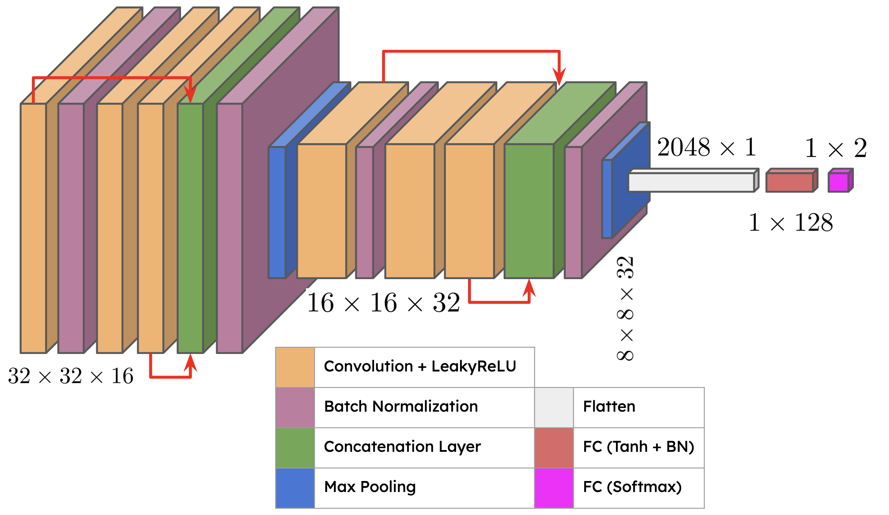
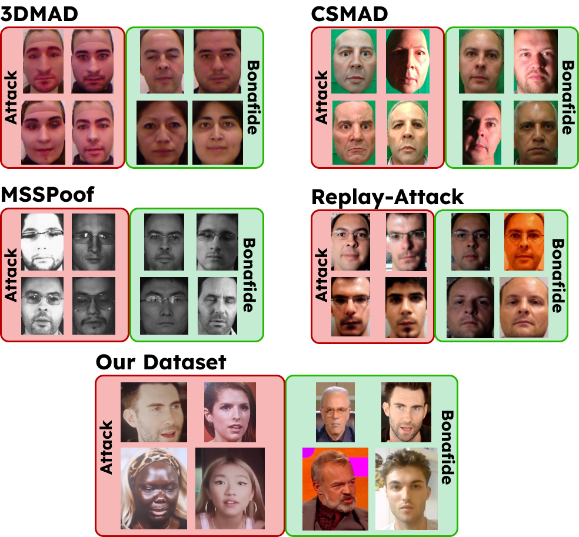
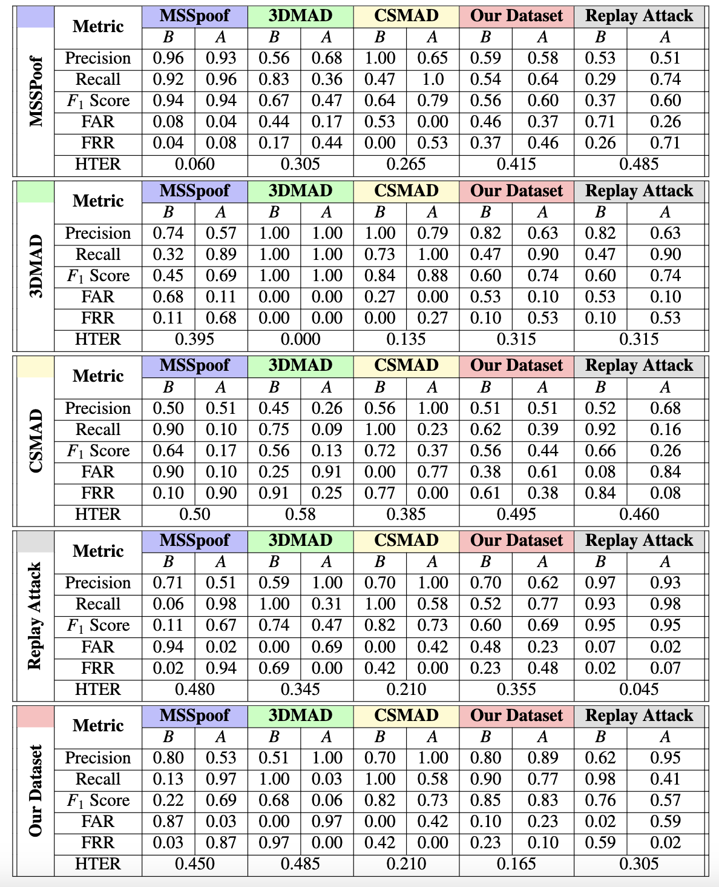

# :japanese_ogre: Liveness detection (aka AttackNet)

## :spiral_notepad: Introduction

Code and materials for a research paper about liveness detection, originated 
from the [Andrea Maranesi's research](https://github.com/andreamaranesi/Spoofing-Attack-Detection-2022/tree/main).

The idea of this project is to create a model, which we call _AttackNet_, that can detect if 
the given face is fake or not. 

## :building_construction: Model architecture

## :card_file_box: Datasets used

For this research paper we used five different datasets:
- [CSMAD]()
- [3DMAD]
- [MSSPoof]
- [Replay-Attack]
- Our Dataset

Some of the example images from the datasets are shown below.

## :ballot_box_with_check: Cross-Validation Results

To test our model, we trained the neural network on one dataset 
and then assessed it on the other one. Results are shown below.

